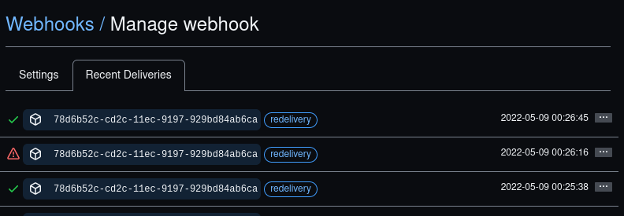
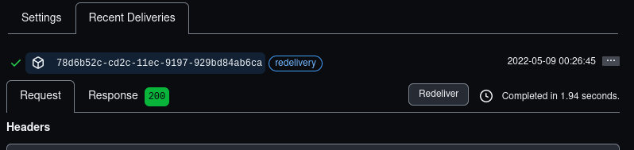

# Pushy Plugin

The **Pushy** Plugin is an extension for [Grav CMS](https://github.com/getgrav/grav).

Publish ("push") changes to your production environment from your editing (or development or other) environment Admin dashboard.

This plugin uses Git and is heavily inspired by the [GitSync plugin](https://github.com/trilbymedia/grav-plugin-git-sync). Unlike GitSync, however, there is a lot more manual setup by the developer, less (IMHO) scary magic, and more control. It will never do anything automatically that you haven't set up.

<!-- TODO: feature comparson table -->

The primary use case for Pushy is so that non-technical content editors can edit (primarily) pages on another Grav instance using Grav Admin, and then push their changes from there to the production server instance. This is all tracked by Git and easy to revert.

The advantages of pushing from an editing environment are:

* it provides a safe sandbox, you won't break production;
* it opens up the possibility of multiple content editors;
* there is no need to install the Admin plugin on your production Grav instance.

I took Git out of the plugin name and user interface because content editors and other non-technical users don't care.

## Installation

Installing the Pushy plugin can be done in one of three ways: The GPM (Grav Package Manager) installation method lets you quickly install the plugin with a simple terminal command, the manual method lets you do so via a zip file, and the admin method lets you do so via the Admin Plugin.

> After folowing one of the download steps described below, **you need to run `composer install` at the command line from the plugin diectory.** This installs the PHP libraries needed by this plugin. Be sure to run this, if possible, _as the same user that Grav runs as_, otherwise you may need to fix the file permissions of this plugin's `vendor` directory.

### GPM Installation (Preferred)

> This option will be available if/when this plugin is mature enough to be accepted into the official Grav plugin repository.
<!--
To install the plugin via the [GPM](https://learn.getgrav.org/cli-console/grav-cli-gpm), through your system's terminal (also called the command line), navigate to the root of your Grav-installation, and enter:

    bin/gpm install pushy

This will install the Pushy plugin into your `/user/plugins`-directory within Grav. Its files can be found under `/your/site/grav/user/plugins/pushy`.
-->

### Manual Installation

To install the plugin manually, download the zip-version of this repository and unzip it under `/your/site/grav/user/plugins`. Then rename the folder to `pushy`. You can find these files on [GitHub](https://github.com/hughbris/grav-plugin-pushy) or via [GetGrav.org](https://getgrav.org/downloads/plugins).

You should now have all the plugin files under

    /your/site/grav/user/plugins/pushy
	
> NOTE: This plugin is a modular component for Grav which may require other plugins to operate, please see its [blueprints.yaml-file on GitHub](https://github.com/hughbris/grav-plugin-pushy/blob/main/blueprints.yaml).

### Admin Plugin

If you use the Admin Plugin, you can install the plugin directly by browsing the `Plugins`-menu and clicking on the `Add` button.

## Configuration

Before configuring this plugin, you should copy the `user/plugins/pushy/pushy.yaml` to `user/config/plugins/pushy.yaml` and only edit that copy.

Here is the default configuration and an explanation of available options:

```yaml
enabled: true
# git:
  # bin: # optional filesystem path to git executable, use this only if git is not in your execution path
folders: # which folders under Grav's user folder do you want to check for changes?
  - pages # typically, this default will be fine but you can provide more specific paths and add as many as you like
logging: true # record Git and plugin actions in Grav's log
webhooks:
  enabled: false # whether we serve and respond to webhooks
  path: /_webhooks # the base path of the webhooks
  # secret: # the webhook secret - DANGER, will serve without authentication if not set
  # endpoints: # which endpoints we respond to
    # publish: # example value, would be served at /_webhooks/publish
      # run: # run this custom job when valid requests are received
      # conditions: # optionally add some conditions on when to trigger the custom job
        # branch: # only on this branch of the commit
        # committer: # email of the git committer
```

Note that if you use the Admin Plugin, a file with your configuration named pushy.yaml will be saved in the `user/config/plugins/`-folder once the configuration is saved in the Admin.

> Because this plugin requires a developer to set it up, creating Admin blueprints is a low priority enhancement. Please edit the YAML instead.

## Usage

The plugin is built with a specific workflow and technical stack in mind, but may be adaptable or extensible.

The goal is to edit changes in one environment ("E") and "push" them up to a git host ("`origin`"), which is then picked up and the changes are pulled down to a receiving environment ("R"). Typically, _E_ would be a Grav installation with the Admin plugin where a content editor works. `Origin` would be a repository on something like Github. _R_ would be a production server.

<!-- TODO: illustrate this with a diagram -->

Your Grav Git repository is assumed to be under your `user` directory. Here is the process in more detail:

* On _E_, the Git repo's current branch is one you have set up for edits from your Admin user.
* Changes to the repository are committed through the Admin dashboard when the editor presses a button.
* A githook has been set up to push any commits in that branch up to `origin`.
* A webhook has been set up on your `origin` git provider for that repository to trigger a notification to _R_ on push events.
* _R_ has this plugin configured to respond by triggering an inactive Grav scheduled task (so _not_ technically scheduled) on these notifications (TBC).
* The inactive scheduled task performs a sequence something like: check branch → pull → merge &lt;branch> → tag → push.

### An incremental approach to deploying end-to-end publishing and testing it

There are lots of moving parts in this pipeline and it pays to set them up and test them methodically, both in isolation and together. You need to have a lot of ducks in a row.

> **Back up your `user` folder.**<br>
> This will give you an option to recover your work if anything goes wrong. Nothing major _should_ go wrong here, but it's better to have peace of mind. **You have been warned.**

#### Local repository is set up correctly
🦆 Initialise your Git repository in your `user` folder.

✔ Test this by checking the Git repository status with your Git client (`git status` or using a front end).

#### You are logged into Admin with sufficient permissions
🦆 You must be logged in as a user in the group 'publishers'.

✔ Refresh any Admin page and see if "Publishing" or "Publish" comes up in the side menu.


#### The plugin's Git library is installed
🦆 If you didn't do this when you installed this plugin, refer to note under [Installation](#Installation).

✔ Refreshing any Admin page and confirm that "Publish" comes up in the side menu.


#### Folders are visibly monitoring for changes
🦆 In your plugin configuration, set the folder(s) to consider. For experimentation, you might start with something very specific, like a single page path you intend to edit. In normal operation, you probably want `pages` and maybe some others. See also [Configuration](#Configuration).

✔ Make a small change within a path that is listed in `folders`. Go to "Publish" in the Admin menu and make sure your change is shown. _Note that your change is not staged or committed at this stage, so you could easily revert your test change using Git if you want to._

#### Changes commit correctly
🦆 Skip this step if the previous ones have been successful and you are "feeling lucky™". It's really a consolidation. Check out a new Git branch if you want to revert this easily. Add a commit message/description and press the "Publish" button below your changes in Admin.

✔ Check that no errors show. Now check your Git log for a correct entry.

#### _E_ is connected to your `origin` remote repository
🦆 In Git, if your repository isn't yet been connected to `origin`, add it using `git remote add origin <URL>` or using a Git front end.

✔ Test this by running a `git fetch` (or equivalent) and looking for errors.

#### Grav can access a private repository without being prompted for a password
🦆 In a real world authoring/publishing worflow, you will almost certainly want to keep your remote repository private. So it's good to test that you can push to a remote private repository without password prompts, from within the plugin. Importantly, make sure you test your remote connection as the same user that Grav runs as in your webserver. In some setups, that won't be possible because the webserver user has no ability to log in.

> If you are running Grav in a Docker container (or maybe a similar isolated environment), you may need to [set up an SSH key](https://docs.github.com/en/authentication/connecting-to-github-with-ssh) or (perhaps more simply) or use a [Personal Access Token (PAT)](https://github.com/settings/tokens) in your remote URL (e.g. https://&lt;TOKEN>@github.com/&lt;USER>/&lt;REPO>.git).

✔ Run `git fetch` as the Grav webserver user on a remote private repository. Make sure you weren't prompted for more input and that no error messages showed.|

#### Commits on _E_ trigger a push to `origin`
🦆 We will set up a post-commit hook on _E_. Create a new file called `post-commit` under `.git/hooks/` with a single line: `git push origin &lt;BRANCHNAME>`. This will be triggered when commits are made. **Make sure you make this file executable** by the webserver user. _You can remove or rename this file or make it non-executable if you want to pause your commit trigger._

✔ Try committing through your Git client first if you like. See if it pushes. Then you'll have to set up more small changes to test, repeating some steps above. Now set up a test edit and 'Publish' through Admin (as described above) and check that your changes were pushed to your remote `origin`.

#### On your target platform, Grav's webserver user can run a script
🦆 Moving to the remote target (publication) server _R_ now, let's write a trivial batch script. We aim to show that the webserver user can run scripts. If your webserver user doesn't have shell capabilities, you'll need to skip this. _If you are able_, switch or start a shell session as the user Grav runs as on the webserver. Create a new test file `.git/hooks/test-ops.sh` <!-- FIXME -->containing:

```sh
cd /var/www/grav/user
ls -la
```
If the path to your Grav `user` directory differs, adapt the `cd` line. Now set the file as executable.

✔ From the `user` folder and as the webserver user, at the command prompt enter `.git/hooks/test-ops.sh`. You should see a detailed list of files in `user` with no error messages.

#### On your target platform, Grav can pull and merge from the private repository without any password prompts
🦆 Let's edit your batch script on _R_. We'll check that Grav's webserver user can run a merge, or whatever is required, which accesses the private repository, and can do that without any password prompts. _If you are able_, switch or start a shell session as the user Grav runs as on the webserver. We could just test this with a single shell command, but let's edit our test file `.git/hooks/test-ops.sh` <!-- FIXME -->instead:

```sh
cd /var/www/grav/user
git fetch
```
Change `fetch` to a bolder operation that requires private access if you feel it. Make sure your file is executable. See the note above about using a Private Access Token (PAT) if you are in an isolated environment.

✔ From the `user` folder, as the webserver user, at the command prompt enter `.git/hooks/test-ops.sh`. You should see only happy messages or nothing at all.

#### A dormant custom Grav job is set up on _R_
🦆 Now we'll set up a test [custom job](https://learn.getgrav.org/17/advanced/scheduler#custom-jobs) in Grav running our test batch script. As a custom job, it's easy to trigger from Grav. You only want to define this job in Grav's scheduler for the _R_ environment, which means you need to edit or create the file at `user/env/&lt;SERVER_HOSTNAME>/config/scheduler.yaml`. Add this test custom job:

```yaml
status:
  test-job: disabled
custom_jobs:
  test-job:
    command: 'user/.git/hooks/test-ops.sh'
    at: '0 0 31 2 0' # should never run automatically even if this is accidentally disabled
    output: /var/www/grav/logs/test-job.out
    output_mode: append
```
You may need to adjust some of those file paths for your server setup. This custom job is defined with two precautions against being automatically run: it is disabled, and it only triggers on the 31st February (never).

✔ You may be able to test initiating this job as the Grav user by triggering it at the command line using `bin/grav scheduler -r test-job`, but I was not able to see my custom job for some reason. However, it did run when triggered at the next test step (webhooks). You can see that the job was triggered by checking its specified `output` file location.

#### _R_ responds to webhooks requests
🦆 If the plugin is working correctly and webhooks are enabled, Grav should provide responses at certain endpoints defined in the plugin's configuration. Like your test custom job, you'll only want to define this job in Grav's scheduler for the _R_ environment. So edit or create this file at `user/env/<SERVER_HOSTNAME>/config/plugins/pushy.yaml`. Now add this:

```yaml
webhooks:
  enabled: true
  path: /_webhooks

  endpoints:
    publish:
      run: test-job
```

✔ Test the webhook you defined by sending POST requests to https://&lt;your-server>/_webhooks/publish. If you don't have an easy way to do this, you can test it in the next step too. Here are some test requests and expected responses using curl:

```shell
$ curl -I https://<your-server>/_webhooks/publish # expected response: 405 Method Not Allowed
$ curl -I https://<your-server>/_webhooks -X POST # expected response: 300 Multiple Choices
$ curl -I https://<your-server>/_webhooks/publish -X POST # expected response: 400 Bad Request (no payload)
$ curl -I https://<your-server>/_webhooks/broken -X POST # expected response: 404 Not Found
```
We'll test for successful requests and add more complexity in the next step. We'd need to make up a sample commit summary payload if we were to test this here, and it's much easier to just do it for real.

#### Origin responds to pushes from _E_ by sending webhook requests to _R_
🦆 We now need to put the key piece in the middle of this pipeline. _These instructions only apply to Github, other providers will presumably have similar setup steps._

In your private repository's 'Settings' on the Github web interface, select 'Webhooks' on the menu. Now 'Add webhook' (a button). Enter your Payload URL as https://&lt;your-server>/_webhooks/publish, which we hopefully tested as responsive in the last step. Content Type should be `content/json`. You don't need to set a secret yet (??)<!-- CHECKME -->. Set 'Enable SSL verification', 'Just the push event', and set it active. Save it.


✔ Now we're testing this by going to _E_. Initiate a change in your repository and push it. You don't need to do this through the Admin or this plugin. You don't need to commit within the folders you set up if you do this outside Admin.

✔ Now check back on the Github website that your webhook is there. When you open it, you should see a 'Recent Deliveries' tab there. You may need to refresh.
Have a look at the response you got.



From Github, it's straightforward to simply resend the same webhook to _R_ if you want to play with settings.



✔ Also check for evidence on _R_ that the test job executed, by looking at the job output file you configured.

Optionally add a webhook secret and some conditions after a successful test. You'd have to configure test conditions on _R_. See [Configuration](#Configuration) above.

> If you made it this far, and especially got successful requests from pushes on _E_, congratulations! You can now set this up with your desired real world publishing workflow actions.

## Credits

* [GitSync plugin](https://github.com/trilbymedia/grav-plugin-git-sync) from Trilby Media (mostly @w00fz I think) for inspiration and some code
* @pamtbaau for assistance with some obscure undocumented Admin techniques that had me stumped

## To Do / Ideas

The best of these are now in [issues](ttps://github.com/hughbris/grav-plugin-pushy/issues).

- [ ] Allow pull updates to sync with a branch on origin (..auth required?)
- [ ] Potentially move the webhooks to a separate plugin
- [ ] CLI, including local webhook creation and remote webhook creation using the Github (etc.) API
- [ ] Add on-screen instructions for installing Git PHP library using composer if not installed
- [ ] Use Github's webhook API to test the response from invoking server webhooks, then notify user
- [ ] Break this README out into smaller docs, it's going to get too involved
- [ ] Find a good, safe location to recommend placing the executable merge (etc) scripts for on-demand invocation by Grav scheduler
